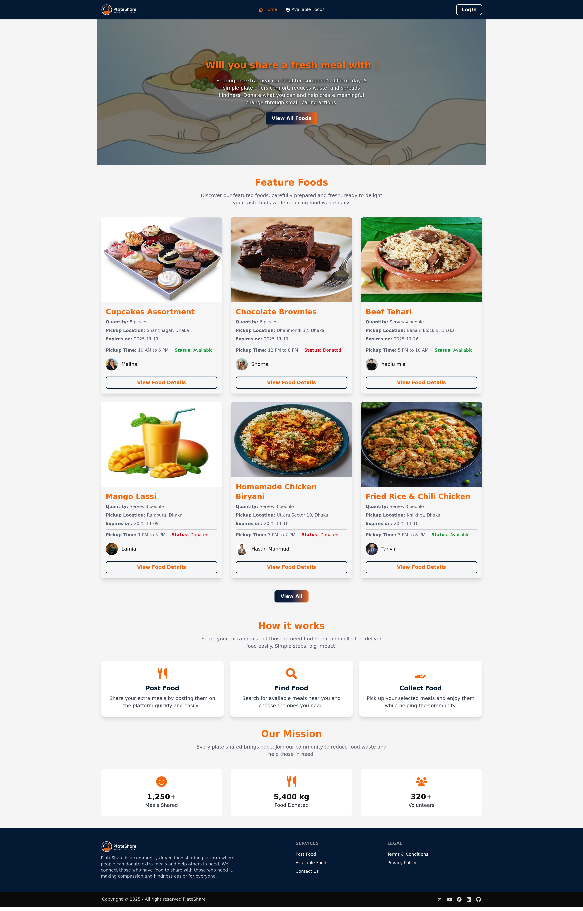
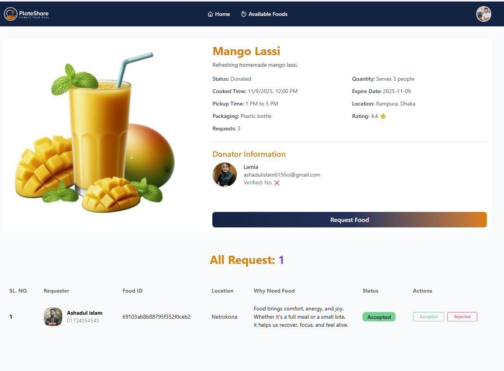
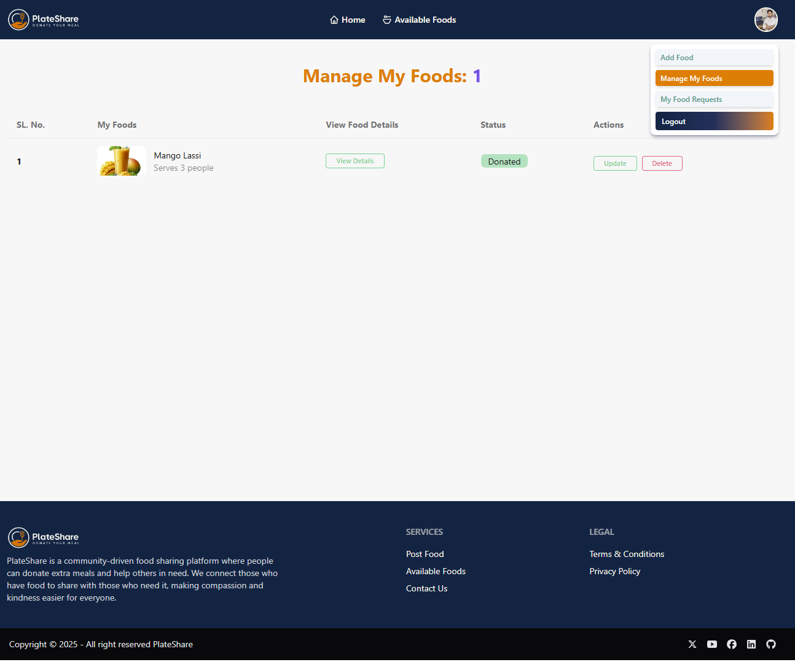

# 🍽️ PlateShare

**Live Site View for Netlify:** [View Live](https://plateshare-community.netlify.app/)

**Live Site View for Cloudflare:** [View Live](https://plateshare-community.pages.dev/)

PlateShare is a community-powered food sharing platform that connects generous donors with individuals and families in need. Built with empathy, trust, and accessibility at its core, PlateShare helps reduce food waste while strengthening local bonds.

---

## 🌟 Key Features

- 🥗 **Browse Available Meals**  
  Discover fresh, home-cooked or packaged food donations with detailed descriptions, pickup times, and expiry info.

* 📊 **Food Request System:** Donors can accept or reject food requests in real time.
* 🕒 **Smart Date & Time Formatting:** Cooked/expiry times shown in human-readable form.

- 📩 **Request Food with Purpose**  
  Authenticated users can submit personalized food requests, including location, contact number, and a message explaining their need.
* 🍱 **Add, Edit, and Manage Foods:** Users can easily post or edit donated foods.
- 👤 **Verified Donor Profiles**  
  Each listing includes donor details with profile image, email, and verification status to ensure transparency and trust.

- 📦 **Clear Packaging & Pickup Info**  
  Listings include packaging type, cooked time, and pickup time windows to help recipients plan safely and efficiently.

- 🚫 **Robust Error Handling & Protected Routes**  
  Includes graceful fallback pages like “404 Not Found” and “Food Not Found,” plus secure access for authenticated users only.

---

## 🛠️ Technologies & npm Packages Used
| Category       | Tools / Libraries          |
| -------------- | -------------------------- |
| Frontend       | React, React Router DOM    |
| Backend        | Express.js,Cors,Node.js, dotenv,MongoDB,Vercel    |
| Styling        | Tailwind CSS, DaisyUI      |
| Authentication | Firebase                   |
| Animations     | React AOS and React Simple typeWriter |
| Icons          | React Icons                |
| Notifications  | React Toastify and sweetalert2            |
| Client Site Deployment     | Netlify & Cloudflare  |
| Server Site Deployment     | Vercel  |
| Data Fetching  | fetch            |
| Data Handling  | MongoDB Database            |

---

## 📂 Folder Structure (Client Side)

Below is the folder structure for the **client** side of PlateShare:

```
client/
├── public/
│   └── _redirects
│
├── src/
│   ├── assets/                
│   │
│   ├── AuthContext/
│   │   └── AuthContext.jsx     
│   ├── AuthProvider/
│   │   └── AuthProvider.jsx    
│   ├── components/            
│   │   ├── Container/          
│   │   ├── ErrorPages/         
│   │   ├── Footer/             
│   │   ├── HomeComponants/ 
|   │   │   ├── FeatureFoods.jsx            
│   │   |   ├── FoodCard.jsx             
│   │   |   ├── HowItWorks.jsx            
│   │   |   └── OurMission.jsx 
│   │   ├── ManageMyFoodsComponants   
│   │   |   └── UpdateMyFood.jsx
│   │   ├── Navbar/            
│   │   |   ├── Navbar.jsx           
│   │   |   └── UserDeshboard.jsx 
│   │   ├── Banner.jsx              
│   │   ├── FoodDetails.jsx            
│   │   ├── FoodRequestCards.jsx           
│   │   └── RequestFoods.jsx          
│   │
│   ├── pages/                
│   │   ├── AddFood.jsx             
│   │   ├── AvailableFoods.jsx           
│   │   ├── Home.jsx       
│   │   ├── LogIn.jsx           
│   │   ├── ManageMyFoods.jsx        
│   │   ├── Register.jsx          
│   │   ├── ViewAllFoods.jsx      
│   │   └── MyFoodRequests.jsx               
│   │
│   ├── Firebase/
│   │   └── Firebase.init.js    
│   │
│   ├── Routes/
│   │   └── Router.jsx          
│   │
│   ├── PrivateRoutes/
│   │   └── PrivateRoutes.jsx          
│   ├── Layouts/
│   │   └── MainLayout.jsx        
│   ├── Loading/
│   │   └── Loading.jsx        
│   │
│   ├── index.css           
│   │   └── tailwind.css        
│   └── main.jsx              
├── .gitignore                      
├── package.json                
├── index.html              
├── eslint.config.js               
├── package-lock.json        
├── vite.config.js             
└── README.md                  
```
---
## Dependencies (Client Side)
```
"dependencies": {
    "@tailwindcss/vite": "^4.1.17",
    "aos": "^2.3.4",
    "firebase": "^12.5.0",
    "react": "^19.1.1",
    "react-dom": "^19.1.1",
    "react-icons": "^5.5.0",
    "react-router": "^7.9.5",
    "react-simple-typewriter": "^5.0.1",
    "react-spinners": "^0.17.0",
    "react-toastify": "^11.0.5",
    "sweetalert2": "^11.26.3",
    "tailwindcss": "^4.1.17"
  },
```
```
"devDependencies": {
    "@eslint/js": "^9.36.0",
    "@types/react": "^19.1.16",
    "@types/react-dom": "^19.1.9",
    "@vitejs/plugin-react-swc": "^4.1.0",
    "daisyui": "^5.4.7",
    "eslint": "^9.36.0",
    "eslint-plugin-react-hooks": "^5.2.0",
    "eslint-plugin-react-refresh": "^0.4.22",
    "globals": "^16.4.0",
    "vite": "npm:rolldown-vite@7.1.14"
  },
```
---
## 📸 Website Screenshots

### 🏠 Home Page


### Food Details Page


### User Profile Image (Dropdown Menu)


---
### 🖥️ How to Run Locally:
1. Clone the Repository

Create file plateshare
```
cd plateshare
```
```
git clone https://github.com/ashadulislam6156rs/PlateShare-Community-Client.git

```
2. Install Dependencies
```
npm i
```
3. Start Development Server
```
npm run dev
```


